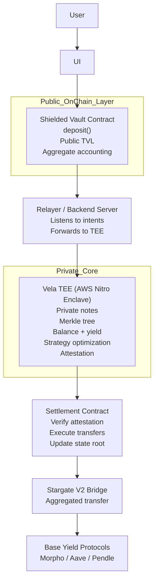
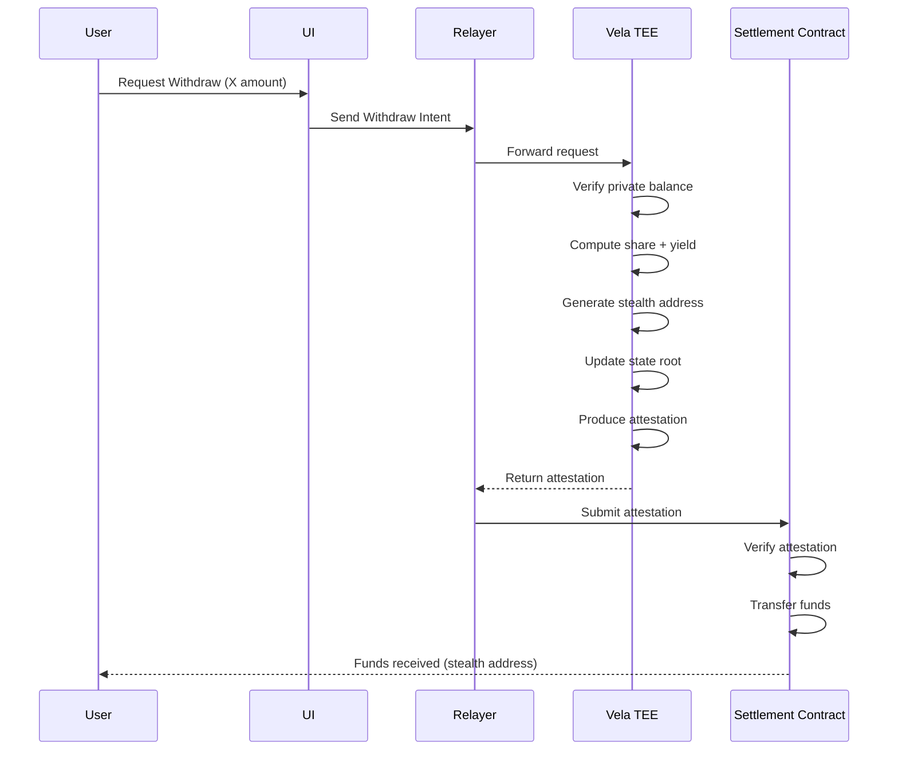

# Shielded Yield Vault

**Shielded Yield Vault** is a privacy-first, cross-chain yield aggregator built on Horizen that enables users to earn optimized yields on Base—while keeping individual positions completely private.

It combines:

* Confidential computation (TEE)
* Cross-chain liquidity (Stargate)
* Automated yield optimization (Base DeFi)

# Technical Architecture

The protocol uses a **hybrid architecture** that balances:

* **Strong individual privacy**
* **Aggregate on-chain transparency**

---

## System Overview



---

## How It Works

### 1. Private Deposits (Horizen)

Users deposit assets into a **Shielded Vault Contract** on Horizen L3.

* Deposits are **not stored as public balances**
* Instead, they are represented as **cryptographic commitments (private notes)**
* Public chain only sees:

  * Total Value Locked (TVL)
  * Aggregate pool movements

---

### 2. Confidential Strategy Engine (Vela TEE)

At the core of the system is a **Vela Trusted Execution Environment (TEE)** powered by AWS Nitro Enclaves.

Inside the TEE:

* Private user balances are reconstructed from notes
* Market conditions are analyzed
* Funds are **dynamically allocated** across:

  * Morpho Blue
  * Aave V3
  * Pendle

Key guarantees:

* No raw user data leaves the enclave
* Strategy logic runs in **hardware-isolated execution**
* Outputs are **cryptographically attested**

---

### 3. Attested On-Chain Settlement

Only a **verified instruction** exits the TEE.

* The **Settlement Contract**:

  * Verifies the TEE attestation
  * Executes the requested action
  * Updates the public state root

This ensures:

* No unauthorized fund movement
* Full trust minimization of off-chain compute

---

### 4. Cross-Chain Liquidity Movement

Funds are bridged using **Stargate V2**:

* Only **aggregated pool funds** are moved
* Individual user allocations are never exposed
* Assets are transferred from:

  * Horizen L3 → Base L2

---

### 5. Yield Generation on Base

On Base, funds are deployed into **audited DeFi protocols**:

* Morpho (efficient lending markets)
* Aave V3 (battle-tested liquidity)
* Pendle (yield tokenization strategies)

Rebalancing and harvesting follow the same flow:

```
TEE Optimization → Attestation → Settlement → Bridge → Deploy
```

---

## Withdraw Flow



---

# Privacy Model

Shielded Yield Vault ensures:

### What is Private

* Individual deposits
* User balances
* Yield earned per user
* Withdrawal amounts
* Transaction linkability

### What is Public

* Total pool TVL
* Strategy allocations (aggregate)
* Bridge transactions
* Performance metrics

This creates a **privacy-preserving yet auditable system**.

---

# Transparency for Compliance & Trust

The protocol is designed to be **compliance-friendly without sacrificing privacy**.

Anyone can verify on-chain:

* Funds are only deployed into **reputable, audited protocols**
* No exposure to:

  * High-risk strategies
  * Unauthorized destinations

This enables:

* Independent auditing
* Community verification
* Institutional confidence