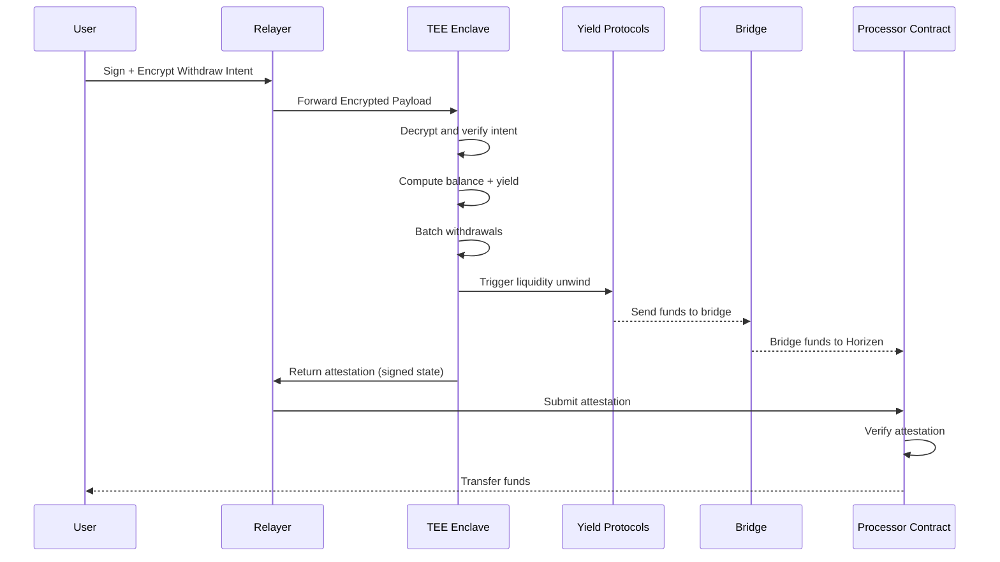

# Shielded Yield Vault

**Shielded Yield Vault** is a privacy-first, cross-chain yield aggregator built on Horizen that enables users to earn optimized yields while keeping individual positions completely private.

It combines:

* Confidential computation
* Cross-chain liquidity
* Automated yield optimization

# Technical Architecture

The protocol uses a **hybrid architecture** that balances:

* **Strong individual privacy**
* **Aggregate on-chain transparency**

---

## Architecture Overview

The protocol uses TEE-managed private state machine. Users submit encrypted intents (deposit/withdraw) signature, which are processed inside a Trusted Execution Environment. The TEE maintains the canonical private state, computes balances and yield, and produces cryptographic attestations that are verified on-chain. The blockchain acts as a settlement and verification layer, while all sensitive computation and accounting happens inside the enclave. Relayers handle gas abstraction and submission, and a Processor contract acts as the synchronization point between on-chain funds and off-chain private state.

---

## How It Works

### 1. Deposit (Horizen)

The user signs a gasless intent (EIP 2612) describing the deposit and encrypts it using the TEE’s public key. This encrypted payload is submitted alongside a transaction to the Processor contract, which executes an ERC20 transferFrom to lock funds on-chain (pool contract) and stores the encrypted blob. At this point, the chain guarantees that funds are secured, but no private state has yet been updated. TEE workers later ingest the encrypted payload, decrypt it inside the enclave, verify the user’s signature, and update the internal private balance state. A new state root is computed and signed, and the attestation is submitted back on-chain to finalize the state transition.

---

### 2. Withdraw (Horizen)

The user submits an encrypted withdraw intent, which is forwarded to the TEE. Inside the enclave, the system decrypts the request, verifies ownership, computes the withdrawable balance including yield, and debits the private state. Withdrawals are batched to improve efficiency and privacy. The TEE then generates a signed attestation authorizing the withdrawal. This attestation is submitted on-chain, where the Processor contract verifies it and executes the ERC20 transfer to the user (from pool contract). This ensures that funds are only released after a valid, attested state transition. All withdraw intents are batched at a fixed window and made available after bridged back to horizen with no user action required.

---

### 3. Relayer

The relayer acts as the **coordination and execution layer** between users, the TEE, and on-chain contracts, enabling a seamless and gas-abstracted experience. It receives user-signed intents for deposits and withdrawals, ensures they are properly formatted, and submits them on-chain or forwards them to the TEE as required. In the deposit flow, the relayer sends the encrypted payload to the Processor contract along with the transaction that locks user funds. In the withdraw flow, it routes encrypted intents to the TEE, receives the resulting attestation, and submits it to the on-chain contract for verification and settlement. The relayer does not access plaintext user data or perform any sensitive computation—it simply transports encrypted payloads and signed attestations across system boundaries. By handling transaction submission, batching, and optional gas sponsorship, the relayer significantly improves UX while maintaining a clean separation between **user intent, confidential computation, and on-chain execution**.

---

### 4. Yield Generation

Funds are bridged using Stargate V2:

* Only aggregated pool funds are moved from the pool
* Individual user allocations are never exposed

Funds are deployed into **DeFi protocols**:

* Morpho
* Pendle

At the current stage of the ecosystem, Horizen offers very limited opportunities for sustainable on-chain yield generation.

* The DeFi landscape is still early and underdeveloped
* Capital efficiency, limited tokens support and liquidity depth are not yet competitive

#### Current Approach

To ensure users still access best-in-class yields, the protocol diversifies

* Deep liquidity exists
* Proven yield strategies are available
* Generates yield externally
* Recalls funds back to Horizen during withdrawals
* Distributes funds privately to users

#### Forward-Looking Design

* More protocols launch
* Liquidity deepens
* Native yield opportunities emerge

We will
* Gradually introduce Horizen-native strategies

---

## Withdraw Flow

# Cryptographic Design

The system relies on encrypted intents, TEE attestation, and state roots rather than user-held cryptographic objects. Users sign structured messages using EIP-2612, ensuring intent authenticity, and encrypt them so only the TEE can read them. The TEE acts as a confidential state machine, reconstructing balances and computing transitions securely. Each state transition produces a signed state root, representing the entire system state. On-chain contracts verify these attestations using hardware-backed proofs, ensuring that only valid transitions are accepted. This design removes the need for users to manage secrets while still preserving strong privacy guarantees.

---

# Privacy Model

Shielded Yield Vault ensures:

### What is Private

* Individual deposits
* User balances
* Yield earned per user
* Withdrawal amounts
* Transaction linkability

### What is Public

* Total pool TVL
* Strategy allocations (aggregate)
* Bridge transactions
* Performance metrics

This creates a **privacy-preserving yet auditable system**.

---

# Overall Transparency for Trust

Anyone can verify on-chain:

* Funds are only deployed into **reputable, audited protocols**
* No exposure to:

  * High-risk strategies
  * Unauthorized destinations

This enables:

* Independent auditing
* Community verification
* Institutional confidence